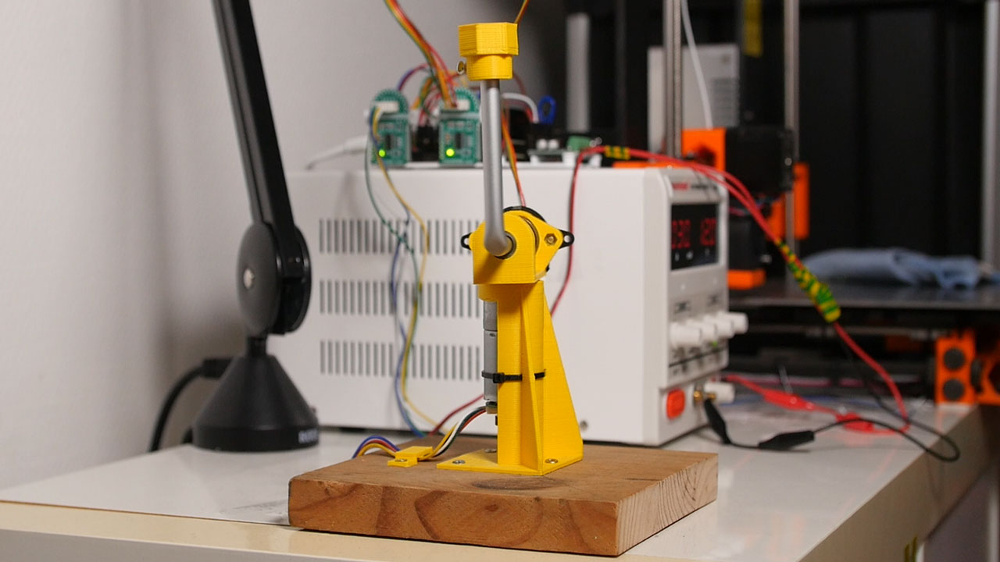

# Furuta Pendulum 

In this repository you will find everything you need to [build and train a rotary inverted pendulum](https://www.youtube.com/watch?v=Y6FVBbqjR40) (also known as a furuta pendulum).

## Table of Content
- [Motivations and Goals](#motivations-and-goals)
- [Getting Started](#getting-started)
- [MLOps](#mlops)
- [Credits](#credits)

## Motivations and Goals
- There are many ([hundreds!](https://www.youtube.com/results?search_query=furuta+pendulum)) videos of rotary inverted pendulum on the internet but we couldn't find good documentation on how to build one and how to control one. This projects aims to make building a furuta pendulum **affordable and reproducible**.
- We wanted to learn about RL. Balancing a pendulum is kind of the "hello world" of the field, it seemed like a good starting point.

## Getting Started
1. [Get the supplies and follow the hardware instructions](https://github.com/Armandpl/furuta/tree/master/hardware)
2. [Follow the software instructions](https://github.com/Armandpl/furuta/tree/master/software)
3. Deploy pre-trained models, run experiments and train the robot

If you have any question feel free to open an issue or DM me [@armand_dpl](twitter.com/armand_dpl).

## MLOps
During this project we leveraged [Weights and Biases](https://wandb.ai/site) MLOps tools to make our life easier. You can find our experiments, pre-trained models and reports [on our dashboard](https://wandb.ai/armandpl/furuta). You can also read more about [Training Repoducible Robots with W&B here](https://wandb.ai/armandpl/furuta/reports/Training-Reproducible-Robots-with-W-B--VmlldzoxMTY5NTM5).

## Credits
To make this robot work we built on top of existing work!
- We got the encoder precision and the idea to use a direct drive motor from the [Quanser Qube design](https://quanserinc.box.com/shared/static/5wnibclu7rp6xihm7mbxqxincu6dogur.pdf).
- We re-used bits from [Quanser's code](https://git.ias.informatik.tu-darmstadt.de/quanser/clients/-/tree/master/quanser_robots/qube). Notably: 
  * their VelocityFilter class to compute the angular speeds
  * their GentlyTerminating wrapper to send a zero command to the robot at the end of each episode
  * their rotary inverted pendulum simulation
  * their ActionLimiter class
- The arm assembly is inspired by this [YouTube video](https://www.youtube.com/watch?v=xowrt6ShdCw) by Mack Tang.
- The visualization we use for the simulation is copy-pasted from https://github.com/angelolovatto/gym-cartpole-swingup
- We use the [StableBaselines3](https://github.com/DLR-RM/stable-baselines3) library to train the robot. 
- We implemented tricks from [Antonin Raffin's talk at RLVS 2021](https://www.youtube.com/watch?v=Ikngt0_DXJg).
  * HistoryWrapper and continuity cost
  * [gSDE](https://arxiv.org/abs/2005.05719)
- We use [code from Federico Bolanos](https://github.com/fbolanos/LS7366R/blob/master/LS7366R.py) to read the encoders counters.

## Authors
[Armand du Parc Locmaria](https://armandpl.com)  
[Pierre Fabre](https://www.linkedin.com/in/p-fabre/)
